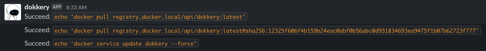

# dokkery

**dokkery (따까리 in Korean)** is designed for handling private docker registry events with considering CI/CD.

## Usage

### Build

Get started to build and run using `docker-compose`:

```
$ docker-compose up --build
Successfully built 735e3c2068b6
Successfully tagged ziwon/dokkery:latest
Starting dokkery_registry_1  ... done
Recreating dokkery_dokkery_1 ... done
Attaching to dokkery_registry_1, dokkery_dokkery_1
dokkery_1   | {"time":"2020-09-01T13:01:54.241136226Z","level":"INFO","prefix":"-","file":"serve.go","line":"59","message":"Starting server on: :8080"}
registry_1  | time="2020-09-01T13:01:54.307170339Z" level=info msg="configuring endpoint dokkery (http://dokkery:8080/api/v1/event), timeout=1s, headers=map[]" go.version=go1.11.2 instance.id=0c0fedfb-bb92-4db7-a522-bb3897354d2f service=registry version=v2.7.1
```

### Push

For testing purposes, let's change the tag of the docker image and push to the registry.

```
$ docker tag ziwon/dokkery:latest localhost:5000/dokkery:latest (for testing purpose)
$ docker push localhost:5000/dokkery:latest
```

### Notification

When a docker registry event is delivered to `dokkery`, it executes the commands that registered for the event in `config.yml` and reports the result.



## Configuration

 In `config.yml`, you can specify `pre` and `post` commands that you want to execute against `push` event on docker registry like the following:

```yml
server:
  address: ":8080"

registry:
  domain: registry.docker.local
  onpush:
    services:
      - name: "dokkery"
        image: "dokkery:latest"
        pre:
          - "echo 'docker pull {}'"
        post:
          - "echo 'docker service update {} --force'"
notify:
  slack:
    webhook: "https://hooks.slack.com/services/foo/bar/baz"
    channel: "#alert"
    message:
      success:
        head: ":sunglasses: Succeeded %s"
      fail:
        head: ":scream: Failed %s"
```


## SSH
In production, we would recommend to use `ssh` to execute the privileged commands like `docker pull` or `docker service update` on the host. You might be required to configure a ssh connection in a `dokkery` container with `~/.ssh/config`, `~/.ssh/id_rsa`, and `~/.ssh/knwon_host` allowing access to the host from a container:

```yml
registry:
  domain: registry.docker.local
  onpush:
    services:
      - name: "swarm_go_app"
        image: registry.docker.local/tools/go-app:latest
        pre:
          - "ssh server-01 docker pull {}"
          - "ssh server-02 docker pull {}"
        post:
          - "ssh server-01 docker service update {} --force"
```

## Todo

- [ ] To filter out more clearly some events coming from unnecessary notifications on the registry side.
