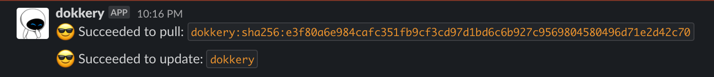

# dokkery

**dokkery (따까리 in Korean)** is designed for handling private docker registry events with considering CI/CD in an on-premise environment.

## Usage

 In `config.yml`, you can specify `pre` and `post` commands that you want to execute against `push` event on docker registry like the following:

```yml
server:
  address: ":8080"

registry:
  domain: registry.docker.local
  onpush:
    services:
      - name: "dokkery"
        image: "localhost:5000/api/dokkery:latest"
        pre:
          - "docker pull {}"
        post:
          - "docker service update {} --force"
notify:
  slack:
    webhook: "https://hooks.slack.com/services/foo/bar"
    channel: "#alert"

```

Then `dokkery` will execute the above commands and will notify the results:



## Using ssh
In production like the Swarm cluster, we recommend to use `ssh` to execute the privileged commands like `docker pull` or `docker service update`. You might have to configure a ssh connection in a `dokkery` container:

```yml
registry:
  domain: registry.docker.local
  onpush:
    services:
      - name: "swarm_go_app"
        image: registry.docker.local/tools/go-app:latest
        pre:
          - "ssh server-01 docker pull {}"
          - "ssh server-02 docker pull {}"
        post:
          - "ssh server-01 docker service update {} --force"
```

## Todo

Currently, it's very unstable.
